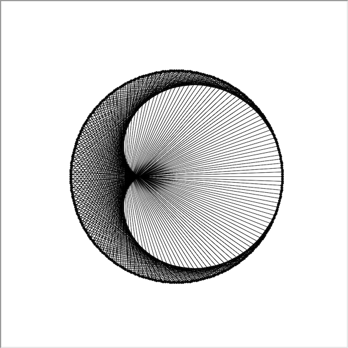
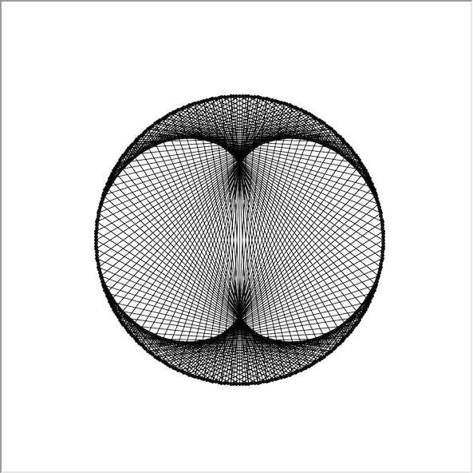
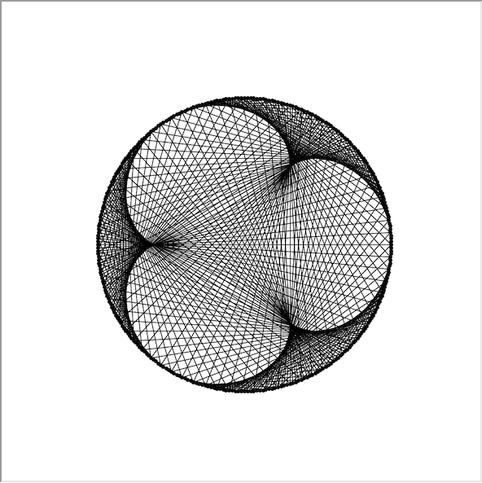
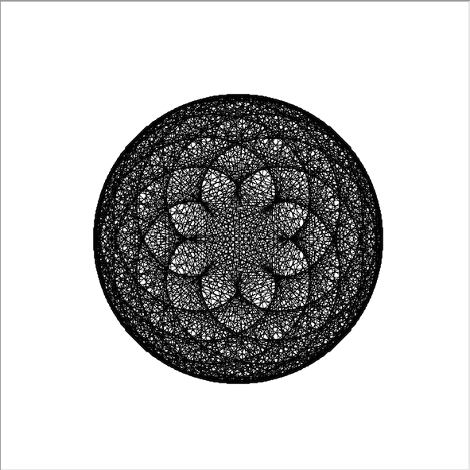

# Epicycloids

These experiments demonstrate a natural phenomenon by a surprisingly algorithmic methodology.

## Description

### Epicycloids in Theory

### Epicycloids in Nature

### Epicycloids in Fractalline Structures

## Methodology

## Simulation Results

### Cardioid (mult = 2, 300 points)

### Nephroid (mult = 3, 300 points)

### Trefoiloid (mult = 4, 300 points)

### Cool Design 1 (mult = 102, 800 points)

## Resources

[Wikipedia - Epicycloids](https://en.wikipedia.org/wiki/Epicycloid)

[Light Ray Reflections - Simon Plouffe](etc/LightsRaysReflections.pdf)

[Mathologer's video regarding this topic](https://youtu.be/qhbuKbxJsk8)
