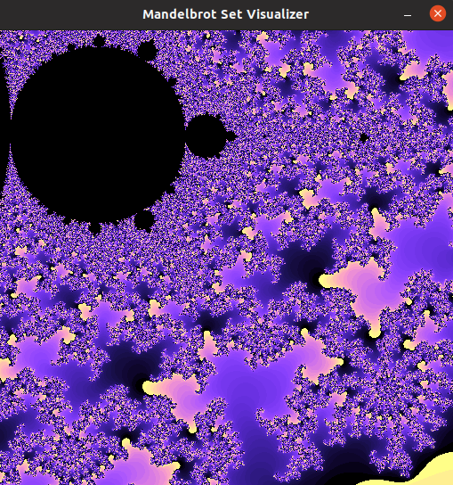
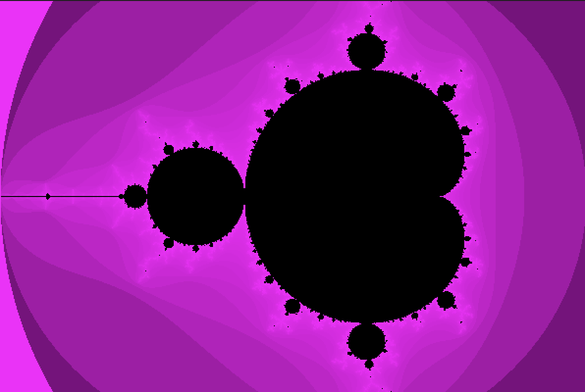
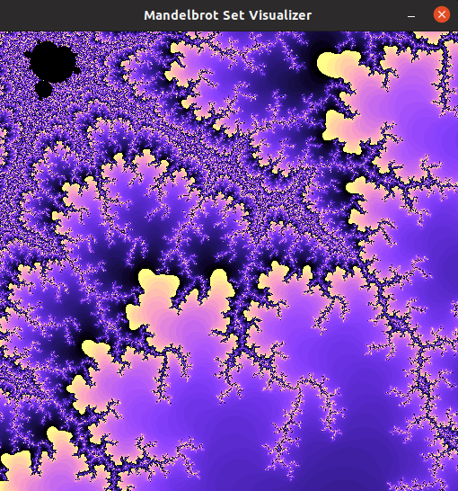

# Mandelbrot Visualization
These experiments demonstrate the simulation of a Mandelbrot set.

## Description and Theory
<!--This section describes the mathematical nature of fractal sets, exclusively pertaining to Mandelbrot sets but encompassing Julia sets as well.-->

### Julia Sets
### Mandelbrot Set

## Algorithmic Methodology
<!--This section details the power iteration methodology necessary to measure the convergence tendancies for coordinates on a map.-->

### Power Iteration Algorithm

```math
z_{n + 1} = z_n^2 + c
```
where c is a complex constant.

```c
int mandelbrot(Dimensions* map, Site* pixel, int iter_offset)
{
	long double x0, y0, x_temp;
	Complex iter;
	iter.real = 0;
	iter.imag = 0;

	pixel -> z.real = scale_x(map, pixel -> pix.x);
	pixel -> z.imag = scale_y(map, pixel -> pix.y);
	while(z_magnitude(iter) < 2 && pixel -> iterations < (MAX_ITERATIONS + iter_offset))
	{
		x_temp = pixel -> z.real + ((iter.real * iter.real) - (iter.imag * iter.imag));
		iter.imag = pixel -> z.imag + (2 * iter.real * iter.imag);
		iter.real = x_temp;
		pixel -> iterations++;
	}
	return pixel -> iterations;
}
```

```c
long double scale_x(Dimensions* map, unsigned int pix_x)
{
	long double scale_factor;

	scale_factor = (long double)((WIDTH - 1) / (map -> x_max - map -> x_min));
	return (map -> x_min) + pix_x / scale_factor;
}

long double scale_y(Dimensions* map, unsigned int pix_y)
{
	long double scale_factor;
	
	scale_factor = (long double)((HEIGHT - 1) / (map -> y_max - map -> y_min));
	return (map -> y_min) + pix_y / scale_factor;
}
```

## Results
<!--This section displays outputs.-->






## Task List
<!--This section lists out certain tasks that have yet to be completed in the development of this project.-->
* [ ] Demonstrate using the Mariani-Silver Algorithm
* [ ] Demonstrate using algorithms involving Perturbation Theory
* [ ] Make a .gif animation that continuously zooms into the canvas up to a certain point
* [ ] Modify the equation to visualize Julia Sets

## Resources